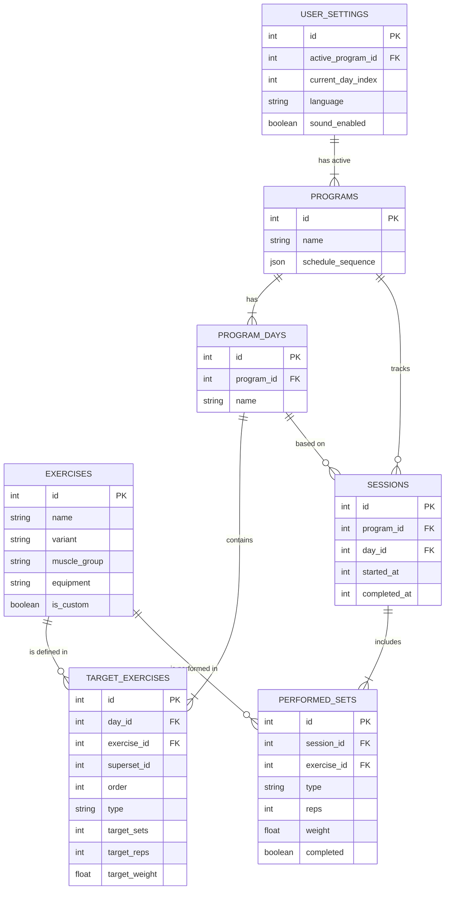

# Data Model - Gym Tracker App (SQLite)

This document defines the relational database schema for the application, implemented using **SQLite** and **Drizzle ORM**.

## 1. Entity Relationship Diagram

## 2. Schema Definitions

### A. `exercises` (Catalog)
The master list of available exercises.

| Column | Type | Description |
| :--- | :--- | :--- |
| `id` | `INTEGER` | Primary Key (Auto-increment) |
| `name` | `TEXT` | Name of the exercise (e.g., "Bench Press") |
| `variant` | `TEXT` | Variation (e.g., "Incline Dumbbell") |
| `muscle_group` | `TEXT` | Primary muscle (e.g., "Chest", "Back", "Legs") |
| `equipment` | `TEXT` | Required equipment (e.g., "Barbell", "Dumbbell", "Machine") |
| `description` | `TEXT` | Instructions or tips |
| `photo_url` | `TEXT` | Path to local image asset |
| `is_custom` | `BOOLEAN` | `true` if created by user, `false` if system default |
| `created_at` | `INTEGER` | Timestamp |

### B. `programs` (Routines)
Top-level container for a workout routine (e.g., "PPL Split").

| Column | Type | Description |
| :--- | :--- | :--- |
| `id` | `INTEGER` | Primary Key |
| `name` | `TEXT` | Program name |
| `schedule_sequence` | `JSON` | Array of day IDs or "rest" strings defining the rotation order.   e.g., `["day_1", "day_2", "rest", "day_1"]` |
| `is_active` | `BOOLEAN` | Only one program should be active at a time |

### C. `program_days` (Split Days)
Represents a specific workout day within a program (e.g., "Push Day").

| Column | Type | Description |
| :--- | :--- | :--- |
| `id` | `INTEGER` | Primary Key |
| `program_id` | `INTEGER` | Foreign Key -> `programs.id` |
| `name` | `TEXT` | Day name (e.g., "Legs") |

### D. `target_exercises` (Planned Workout)
The configuration of an exercise for a specific day. This is what the user *plans* to do.

| Column | Type | Description |
| :--- | :--- | :--- |
| `id` | `INTEGER` | Primary Key |
| `day_id` | `INTEGER` | Foreign Key -> `program_days.id` |
| `exercise_id` | `INTEGER` | Foreign Key -> `exercises.id` |
| `superset_id` | `INTEGER` | (Optional) ID to group exercises into a superset |
| `order` | `INTEGER` | Sort order within the day |
| `type` | `TEXT` | Set type: 'working' (default), 'warmup', 'failure', 'drop' |
| `target_sets` | `INTEGER` | Planned number of sets |
| `target_reps` | `INTEGER` | Planned reps per set |
| `target_weight` | `REAL` | Planned weight (kg/lbs) |
| `rest_time` | `INTEGER` | Rest timer in seconds |
| `notes` | `TEXT` | User notes for this specific setup |

### E. `sessions` (History Header)
A record of a completed or in-progress workout session.

| Column | Type | Description |
| :--- | :--- | :--- |
| `id` | `INTEGER` | Primary Key |
| `program_id` | `INTEGER` | Foreign Key -> `programs.id` (Snapshot) |
| `day_id` | `INTEGER` | Foreign Key -> `program_days.id` (Snapshot) |
| `started_at` | `INTEGER` | Timestamp start (Unix Epoch) |
| `completed_at` | `INTEGER` | Timestamp end (Unix Epoch) (NULL if in progress) |

### F. `performed_sets` (History Details)
The actual work done.

| Column | Type | Description |
| :--- | :--- | :--- |
| `id` | `INTEGER` | Primary Key |
| `session_id` | `INTEGER` | Foreign Key -> `sessions.id` |
| `exercise_id` | `INTEGER` | Foreign Key -> `exercises.id` |
| `type` | `TEXT` | Set type: 'working', 'warmup', 'failure', 'drop' |
| `set_number` | `INTEGER` | 1, 2, 3... |
| `reps` | `INTEGER` | Actual reps performed |
| `weight` | `REAL` | Actual weight used |
| `rpe` | `INTEGER` | (Optional) Rate of Perceived Exertion (1-10) |
| `completed` | `BOOLEAN` | `true` if set was finished |
| `timestamp` | `INTEGER` | Exact time set was logged (Unix Epoch) |

### G. `user_settings` (App State)
Singleton table (only 1 row) to store global preferences and state.

| Column | Type | Description |
| :--- | :--- | :--- |
| `id` | `INTEGER` | Primary Key (Always 1) |
| `active_program_id` | `INTEGER` | Foreign Key -> `programs.id` |
| `current_day_index` | `INTEGER` | Index pointer for `programs.schedule_sequence`. Tracks "What day is today?". |
| `language` | `TEXT` | 'es', 'en', etc. |
| `sound_enabled` | `BOOLEAN` | Global mute toggle |

## 3. Key Design Decisions

*   **JSON for Schedule**: Using a JSON column for `schedule_sequence` avoids a complex "Join Table" for ordering days and allows for flexible patterns (e.g., repeating days, custom rest days) without schema changes.
*   **Separation of Plan vs. Performance**: `target_exercises` stores what you *want* to do. `performed_sets` stores what you *did*. This allows for history tracking even if the plan changes later.
*   **Offline First**: This entire schema lives in a local SQLite `.db` file, ensuring zero latency and full offline capability.

## 4. Indexes (Efficiency)

To ensure high performance as the history grows, the following indexes are required:

| Table | Columns | Purpose |
| :--- | :--- | :--- |
| `exercises` | `name` | Fast search in "Add Exercise" screen |
| `exercises` | `muscle_group` | Filtering by category |
| `performed_sets` | `exercise_id` | Quickly retrieving history for a specific exercise |
| `sessions` | `started_at` | Sorting history by date (Recent workouts) |
| `sessions` | `program_id` | Filtering history by program |
